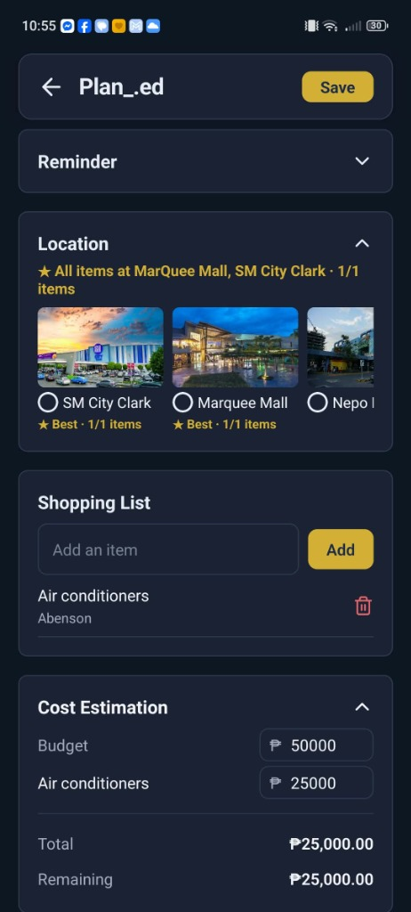
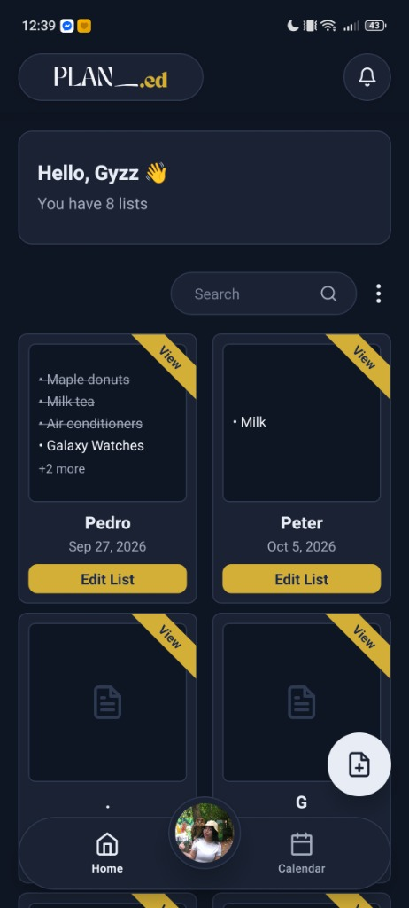
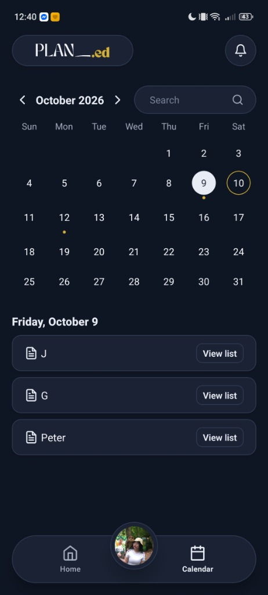
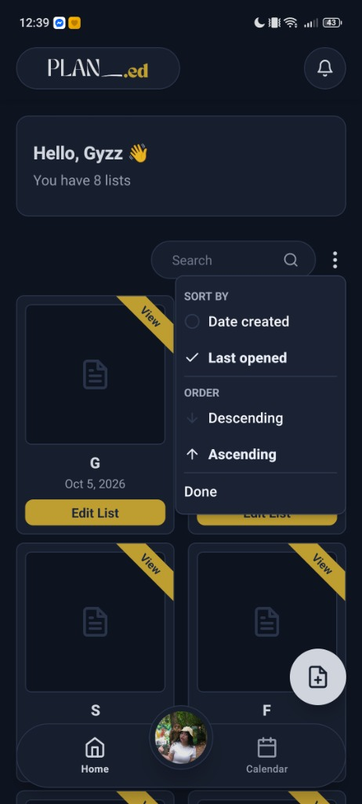
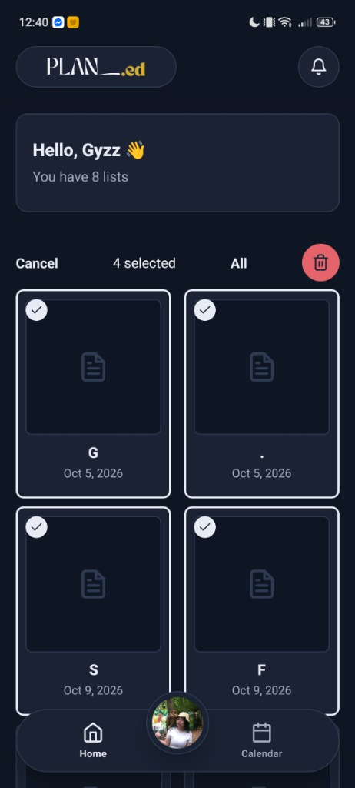
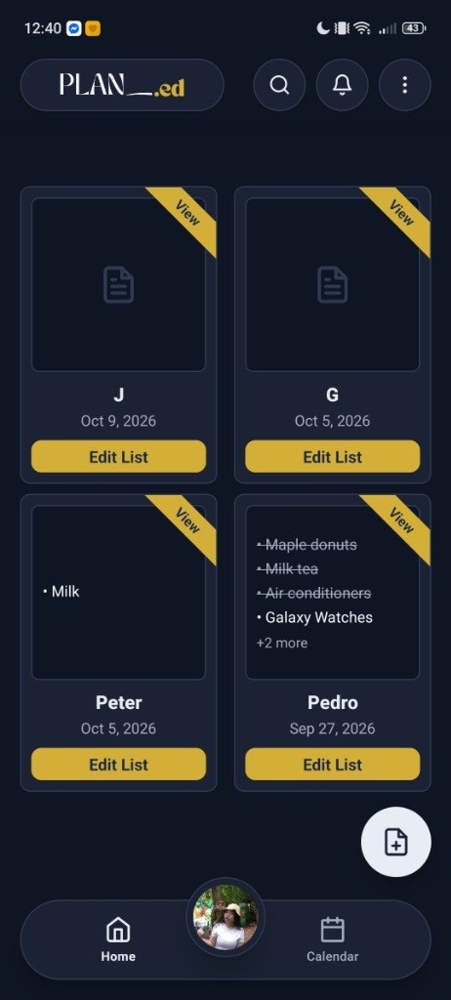

# Plan_.ed

<p align="center">
  
</p>

<p align="center">
  <a href="https://expo.dev/accounts/geyzz/projects/plan_ed/builds/7ab10b7e-9481-4a03-a32b-5c72b10bc365"></a>
  <a href="AI-USAGE.md"></a>
  
</p>

A smart, mall-connected shopping and errand planner mobile app built with React Native and Expo. Plan your shopping trips, organize checklists by store, estimate costs, and schedule reminder alarms.

---

## App Showcase

<p align="center">
  
  &nbsp;&nbsp;
  
  &nbsp;&nbsp;
  
</p>

<p align="center">
  
  &nbsp;&nbsp;
  
  &nbsp;&nbsp;
  
</p>

---

## Features

- **Smart Checklists**: Create shopping lists with quantities, store assignments, categories, and real-time cost calculation.
- **Mall Directory**: Link shopping items to 4 major Pampanga malls (SM City Clark, MarQuee Mall, Nepo Mall, Newpoint Mall) and specific retail stores.
- **Errand Calendar**: Schedule shopping dates and track upcoming trips on an interactive calendar.
- **Reminder Alarms**: Set native device alarms and notifications for planned shopping trips.
- **Cloud & Offline Sync**: Powered by Supabase (PostgreSQL with Row-Level Security) with offline local caching via AsyncStorage.
- **Light & Dark Theme**: Full theme support matching system appearance.

---

## Tech Stack

- **Framework**: React Native, Expo (SDK 57), Expo Router
- **Backend & Database**: Supabase (PostgreSQL, Authentication, RLS)
- **Local Storage**: AsyncStorage
- **Notifications**: Expo Notifications
- **Build**: EAS Build (Android APK)

---

## Getting Started

### Download APK
Download the Android app directly: [**Plan_.ed v1.0.0 APK (Latest Build)**](https://expo.dev/accounts/geyzz/projects/plan_ed/builds/7ab10b7e-9481-4a03-a32b-5c72b10bc365)

### Run in Development

```bash
npm install
npx expo start
```

Scan the QR code using **Expo Go** on Android, or press `a` for Android Emulator.

---

## Project Structure

```text
plan_ed/
├── AI-USAGE.md          # AI disclosure and rubric documentation
├── assets/              # App banners, launcher icons, store images
├── src/
│   ├── app/             # Screens & Expo Router navigation
│   ├── components/      # UI components (atoms, molecules, organisms)
│   ├── lib/             # Supabase client, storage cache, notifications
│   └── theme/           # Color palettes and theme context
├── app.json             # Expo configuration
└── eas.json             # EAS build profiles
```

---

> **AI Disclosure**: This project was built with AI pair-programming assistance from Claude (Anthropic). All core UI components, database architecture, and bug fixes were authored by the developer. See [AI-USAGE.md](AI-USAGE.md) for full records.
